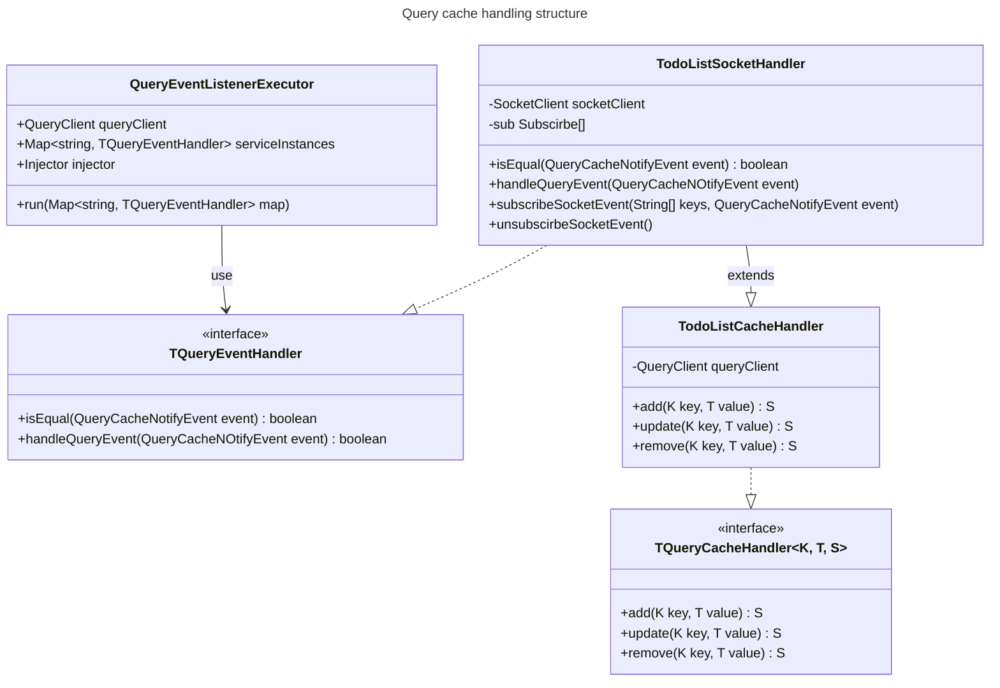

```mermaid
---
title: "Query cache handling structure"
---
classDiagram
  queryProvider
  class QueryEventListenerExecutor
    QueryEventListenerExecutor: +QueryClient queryClient
    QueryEventListenerExecutor: +Map~string, TQueryEventHandler~ serviceInstances
    QueryEventListenerExecutor: +Injector injector
    QueryEventListenerExecutor: +run(Map~string, TQueryEventHandler~ map)
    
  class TQueryCacheHandler~K, T, S~
    <<interface>> TQueryCacheHandler
    TQueryCacheHandler: +add(K key, T value) S
    TQueryCacheHandler: +update(K key, T value) S
    TQueryCacheHandler: +remove(K key, T value) S
    
  class TQueryEventHandler
    <<interface>> TQueryEventHandler
    TQueryEventHandler: +isEqual(QueryCacheNotifyEvent event) boolean
    TQueryEventHandler: +handleQueryEvent(QueryCacheNOtifyEvent event) boolean
  
  class TodoListCacheHandler
    TodoListCacheHandler: -QueryClient queryClient
    TodoListCacheHandler: +add(K key, T value) S
    TodoListCacheHandler: +update(K key, T value) S
    TodoListCacheHandler: +remove(K key, T value) S
    
  class TodoListSocketHandler
    TodoListSocketHandler: -SocketClient socketClient
    TodoListSocketHandler: -sub Subscirbe[]
    TodoListSocketHandler: +isEqual(QueryCacheNotifyEvent event) boolean
    TodoListSocketHandler: +handleQueryEvent(QueryCacheNOtifyEvent event) 
    TodoListSocketHandler: +subscribeSocketEvent(String[] keys, QueryCacheNotifyEvent event) 
    TodoListSocketHandler: +unsubscirbeSocketEvent()

    TodoListCacheHandler ..|> TQueryCacheHandler
    TodoListSocketHandler ..|> TQueryEventHandler
    TodoListSocketHandler --|> TodoListCacheHandler : extends
    QueryEventListenerExecutor --> TQueryEventHandler : use


```

