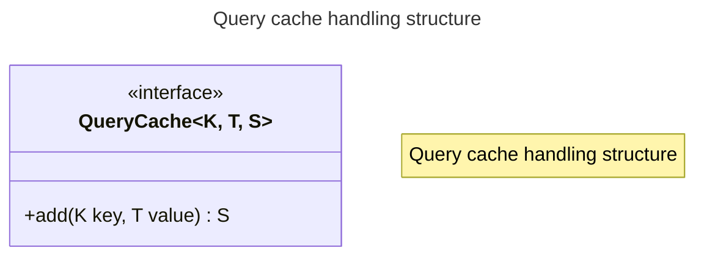

```mermaid
---
title: "Query cache handling structure"
---
classDiagram
  note "Query cache handling structure"
  class QueryCache~K, T, S~
  <<interface>> QueryCache
  QueryCache: +add(K key, T value) S
    
```

