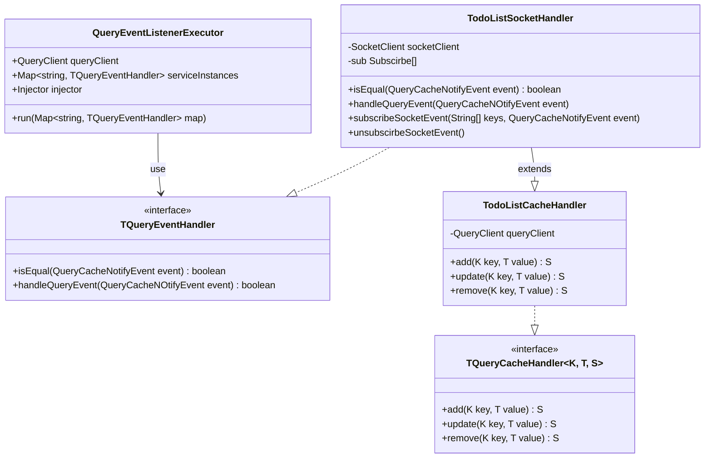

# Tacnstack query todo app
### purpose
- Tacnstack query를 적용하는 방법 학습
- 데이터와 데이터 관리 방법 등을 하나의 단위로 묶어서 관리 할 수 있는지 검토
- 웹소켓과 query를 연동하여 데이터를 실시간으로 관리 할 수 있는지 검토

### tech stack
#### client
- Angular 17
- Tanstack query
- socket.io-client
#### server
- Nest.js
- sqlite3
- socket.io

### install
1. npm install
2. cd server && npm install

### run
1. npm run start (client)
2. cd server && npm run start (server)
3. localhost:4200/todo/list 또는 localhost:4200/todo/widget 접속

### Tacnstack query class diagram

